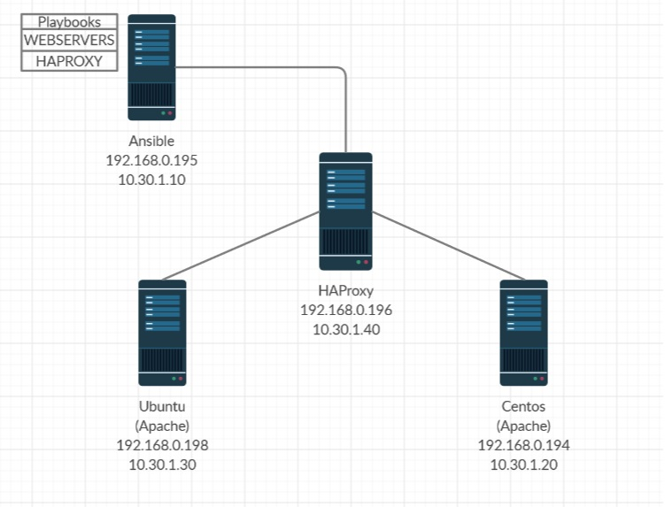

## Playbook de Taller 2020


## Webservers y HAProxy

En este repositorio encontraras los playbooks necesarios para poder montar 2 servidores Apache (Centos o Ubuntu) y un servidor que funcionara como Proxy Reverso y balanceador de carga

Se separan en 2 Playbooks diferentes (WEBSERVERS Y HAPROXY) para poder tener más opciones de modificación

## Requerimientos

Para poder implementar correctamente estos Roles deberá contar con 3 servidores Linux (2 para el sistema apache y otro para el balanceador de carga y proxy reverso

## Variables de los Roles

Como variantes deberá cambiar en el archivo /inventory/hosts.ini por los servidores de su infraestructura
Y deberá especificar las direcciones ip de los servidores a balancear para el rol de haproxy (/haproxy/vars/main.yaml)


## Ejemplos de Ejecución

Pare ejecutarlos solo ejecuta los siguientes comandos:


```bash
ansible-playbook servers-apache.yaml -i inventory/hosts.ini
```
```bash
ansible-playbook haproxy.yaml -i inventory/hosts.ini
```

**Aquí podrás ver el diagrama de red de nuestra infraestructura**


